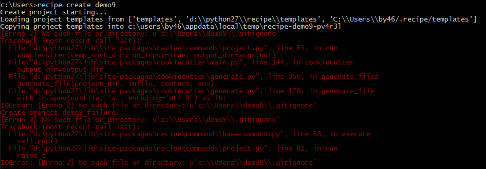

..
	该文档可以包含常见的FAQ列表，以帮助用户快速解决问题。

FAQs
=======================

常见的FAQ列表

提示"[Errorno 2] No such file or directory"?
----------------------------------------------------------------------------

提示如图所示:
|faq1|

A: 如果当前运行Recipe的User， 没有权限在你指定的目录创建文件夹，就会提示该错误