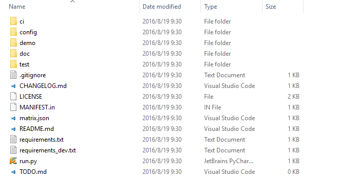
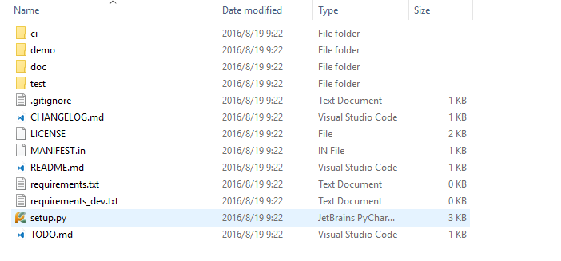
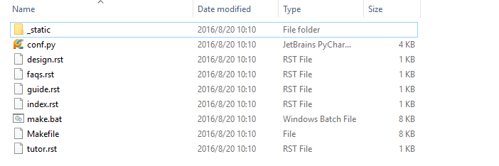

Templates
=======================

Recipe是根据项目模板来构建项目骨架和Jenkins Job，不同项目模板应对不同场景使用。

doc
-----------------------------

该模板用于生成项目文档目录，文档内容必须使用	`reStructuredText <http://docutils.sourceforge.net/rst.html>`_
标记语法书写，你可以参考 `教程 <http://www.jianshu.com/p/1885d5570b37>`_ 。

如果你希望在本机生成文档，你必须安装 `Sphinx <http://www.sphinx-doc.org/en/stable/>`_ ，通过下列命令快速安装：

::

	pip install --trusted-host scmesos06 -i http://scmesos06/simple Sphinx

安装完毕之后，你就可以在切换当前工作目录到doc，并且执行：

::

	make html

就会在doc目录下生成_build文件，通过浏览器浏览doc/_build/html/index.html访问文档。

你也可以通过Archives生成文档， 更多信息请参考 `Archives <http://scmesos06/docs/dfis/archives/>`_ 。

该模板会固定产生doc文件夹，并包含多个文件，目录接口如下：

|doc|

- **index.rst**

文档的入口，里面已经包含了文档目录

- **tutor.rst**

该文档你可以书写一些快速入门的教程，帮助开发者快速使用你的程序

- **guide.rst**

该文档你可以书写接口的详细信息

- **desgin.rst**

该文档你可以包含详细设计文档

- **faqs.rst**

该文档可以包含一些常用的问题列表

python.flask
-----------------------------

该模板用于生成web应用骨架

项目使用 `gevent <http://www.gevent.org/>`_ 作为底层WSGI server，
使用 `Flask <http://flask.pocoo.org/>`_ 作为WSGI application。
作为RESTFul框架，添加了CORS和程序的支持。

不同环境日志记录的地方不同， development环境记录在当前工作目录下logs/error.log,
而GQC 和PRD则记录到/var/demo/error.log。demo为项目名字，会根据生成是的项目名称而变化。

你可以指定该路径，修改对应环境配置文件中的 ``LOG_FILENAME`` 配置项的内容。

.. attention::
	项目资源URL默认添加了项目名称的前缀，例如： 创建demo项目时，所有资源的
	根路径为http://127.0.0.1/demo, 这个是为了支持nginx 或者haproxy这样的反向代理。

	项目默认添加了以下三个资源：

	1. http://127.0.0.1/demo/faq.htm 用于支持Netscaler
	2. http://127.0.0.1/demo/version 用于查看当前程序的版本，会读取 demo\__init__.py 中的__version__变量
	3. http://127.0.0.1/demo web 首页

下面生成名为demo的项目，目录结构如下：

|flask|

- **demo**

该目录包含项目的主要代码，其中包含 ``db``, ``static``, ``templates``, ``views`` 目录。
static目录存放项目的静态资源，templates目录存放项目的jinja2模板文件。

- **config**

该目录包含项目的配置文件，主要分为default.py, development.py, gqc.py, prd.py，
分别对应默认配置，开发环境，gqc环境，和PRD环境配置。通过设置环境变量 ``ENV``
来控制加载配置文件的行为，例如: 设置 ``ENV=prd`` ， 就会加载prd.py的配置

- **ci**

Jenkins对应Job执行的shell脚本。

- **doc**

项目文档，详细信息请参考 `Archives <http://scmesos06/docs/dfis/archives/>`_ 。

- **test**

项目单元测试目录，存放对应的单元测试脚本。

- **run.py**

项目程序入口， 执行 ``python run.py`` 运行程序， 默认情况下会加载development.py的配置，
你可以通过设置环境变量 ``ENV`` 来控制加载配置的行为，例如运行PRD的配置：

::

	ENV=prd python run.py

python.restful
--------------------------------

该模板用于生成RESTFul风格的api应用程序。

项目使用 `gevent <http://www.gevent.org/>`_ 作为底层WSGI server，
使用 `Flask <http://flask.pocoo.org/>`_ 作为WSGI application， 并使用 `Flask-RESTful <https://flask-restful.readthedocs.io/en/latest/>`_
作为RESTFul框架，添加了CORS和程序的支持。

不同环境日志记录的地方不同， development环境记录在当前工作目录下logs/error.log,
而GQC 和PRD则记录到/var/demo/error.log。demo为项目名字，会根据生成是的项目名称而变化。

你可以指定该路径，修改对应环境配置文件中的 ``LOG_FILENAME`` 配置项的内容。

.. attention::
	项目资源URL默认添加了项目名称的前缀，例如： 创建demo项目时，所有资源的
	根路径为http://127.0.0.1/demo, 这个是为了支持nginx 或者haproxy这样的反向代理。

	项目默认添加了以下三个资源：

	1. http://127.0.0.1/demo/faq.htm 用于支持Netscaler
	2. http://127.0.0.1/demo/version 用于查看当前程序的版本，会读取 demo\__init__.py 中的__version__变量
	3. http://127.0.0.1/demo/api/v1/version 用于查看当前程序的版本，会读取 demo\__init__.py 中的__version__变量

下面生成名为demo的项目，目录结构如下：

|flask|

- **demo**

该目录包含项目的主要代码，其中包含 ``db``, ``static``, ``templates``, ``views`` 目录。
static目录存放项目的静态资源，templates目录存放项目的jinja2模板文件。

- **config**

该目录包含项目的配置文件，主要分为default.py, development.py, gqc.py, prd.py，
分别对应默认配置，开发环境，gqc环境，和PRD环境配置。通过设置环境变量 ``ENV``
来控制加载配置文件的行为，例如: 设置 ``ENV=prd`` ， 就会加载prd.py的配置

- **ci**

Jenkins对应Job执行的shell脚本。

- **doc**

项目文档，详细信息请参考 `Archives <http://scmesos06/docs/dfis/archives/>`_ 。

- **test**

项目单元测试目录，存放对应的单元测试脚本。

- **run.py**

项目程序入口， 执行 ``python run.py`` 运行程序， 默认情况下会加载development.py的配置，
你可以通过设置环境变量 ``ENV`` 来控制加载配置的行为，例如运行PRD的配置：

::

	ENV=prd python run.py

python.lib
------------------------------

该模板用于开发纯Python扩展包，包含Jenkins的CI文件夹，用于测试的test文件夹，用于文档
的doc文件夹，项目文件，还有一些必要的资源文件.

下面生成名为demo的项目，目录结构如下：

|lib|

- **demo**

项目的主要代码

- **setup.py**

用于发布Python扩展包的安装脚本，该脚本依赖 `setuptools <https://setuptools.readthedocs.io/en/latest/>`_ 。
一般情况下，安装pip时，就已经安装了setuptools。

newkit.app
--------------------------------------

该模板仍在开发中

