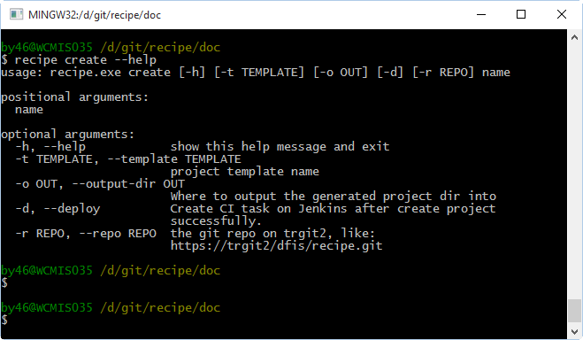

Quick Start
==========

依赖
--------------------

* `Python 2.7+ <http://www.python.org/>`_
* `PIP <https://pip.pypa.io/en/stable/>`_

安装
--------------------

该项目托管在我们的PYPI私有仓库, 所以你可以通过PIP来快速安装，
PIP使用细节可以参照 `PIP使用指南
<http://confluence.newegg.org/display/DFIS/PIP>`_.

通过以下命令快速安装recipe：

::

  pip --trusted-host scmesos06 install -i http://scmesos06/simple recipe

查看帮助
---------

成功安装Recipe之后，你可以在命令行执行如下命令，获取帮助信息：

::

  recipe -h
  recipe --help

或者你可以通过以下命令行查看某个具体子命令使用规则，以create命令为例：

::

   recipe create -h
   recipe create --help

命令执行结果如下：
|help|

创建项目
---------------

创建Git仓库
+++++++++++++

首先，你需要在trgit2代码托管仓库上创建一个git仓库，记录下git仓库地址， 例如：http://trgit2/dfis/demo.git

生成项目
++++++++++++++

然后，你只需要执行如下命令，就可以快速创建项目：

::

  recipe create  --repo http://trgit2/dfis/demo.git --deploy demo

该命令会做两件事：

* 默认使用python.flask项目模板，在当前工作目录下生成名为demo的项目
* 并且默认在jenkins上创建一系列用于持续集成的相关Job

现在我们提供了两种项目模板，python.flask和python.lib，你可以添加参数 ``--template`` 来切换使用的项目, 使用方式如下：

::

	recipe create --template python.lib  --repo http://trgit2/dfis/demo.git --deploy demo

创建Jenkins CI Jobs
---------------

通常情况下， 你可能需要创建项目、创建继续集成一步完成。
但是，有可能存在这种情况，你的项目已经存在、并且进行了大量的开发，你只想快速创建Jenkins相关的jobs。
``deploy`` 子命令就是为你准备，``deploy`` 会根据不同模板创建相应的Jenkins jobs， 命令如下：

::

  recipe deploy --template python.flask --repo http://trgit2/dfis/demo.git demo

它会创建一系列Jenkins jobs，并且把http://trgit2/dfis/demo.git仓库的develop分支作为VCS源。

查看模板
---------------

Recipe 提供了多种项目模板，你可以通过 list参数来查看所有可用的模板：

::

  recipe list

查看版本信息
---------------

你可以通过version子命令来检查项目版本：

::

	recipe version

